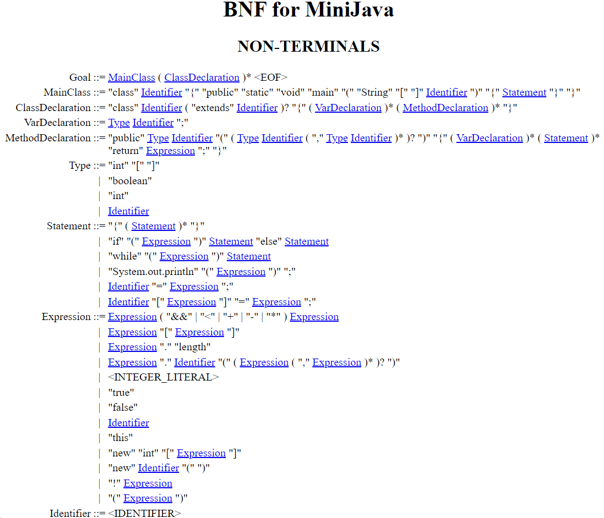

# Minijava with GALS and C++

## 📚 Objective?

The goal of this application is to implement a minified version of Java, also called Minijava. The BNF for this application is located at [Cambridge](https://www.cambridge.org/resources/052182060X/MCIIJ2e/grammar.htm#prod2) or the image below.

 
 

## ⚙️ How it is done?

For this project choose to use GALS (Gerador de Analisadores Léxicos e Sintaticos) a brazilian software developed by Carlos Eduardo Gesser. You can read more about it in [here](http://gals.sourceforge.net/help.html).

Using GALS we were able to create all the necessary steps to create most of the implementation for Minijava. Through the software we generated all the Regular Definitions, Tokens, Non-terminals and wrote our Grammar. Is worth mentioning that you'll need to change your grammer to a specif format accepted by GALS.

 

## ✨ Technologies

- Geradores de Analisadores Léxicos e Sintáticos (GALS)
- Visual Studio Code
- C++

 

## 🧑‍💻 Developers

- Evandro Rodrigues de Paula Junior (@evnrodr)
- Jordão Rodrigues Dantas (@jordao0707)

 

Project made with ☕ and 💖

